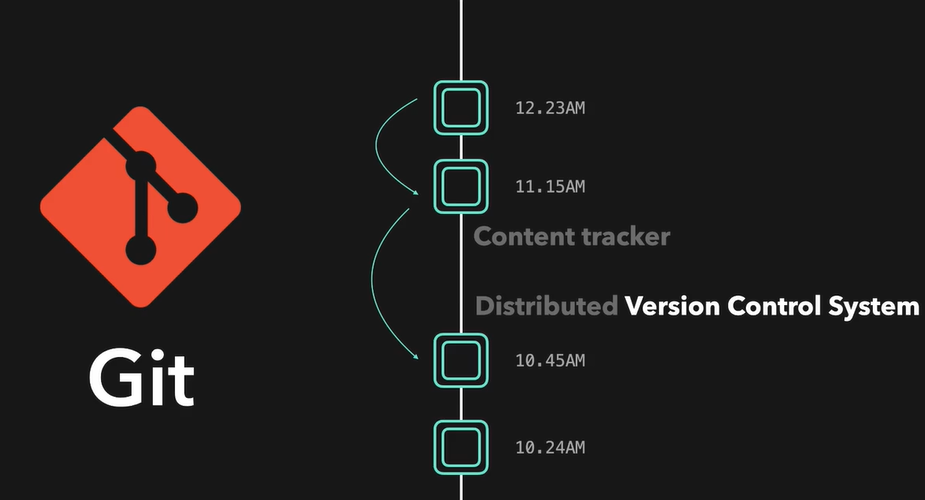
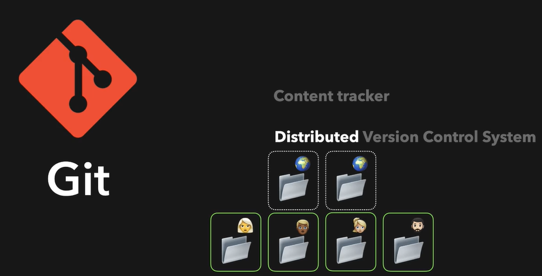
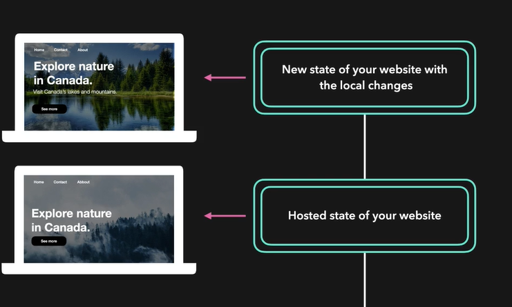
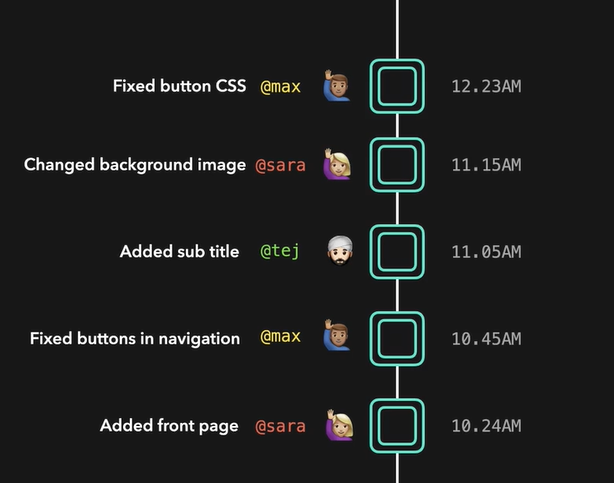

# Git Introduction
  - Take me to [Video Tutorial](https://kodekloud.com/topic/git-introduction/)

In this section, we will take a look at Git Introduction

## Git
- Git is a **`Distributed Version Control System`**
- Git is a content tracker, it stores all our code changes.

  
  
- Distributed means it has a remote repository which is stored in a server and a local repository which is stored on the computer of every developer working on a project. Every developer has a full copy of the code base.
  
  
  
- We can go back in time, without loosing any new changes.

  

- You have access to entire project history

  
