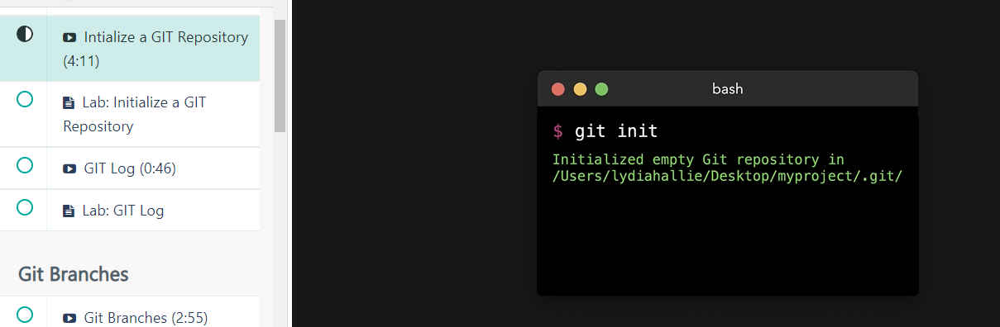
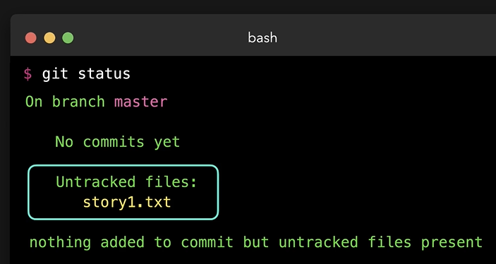
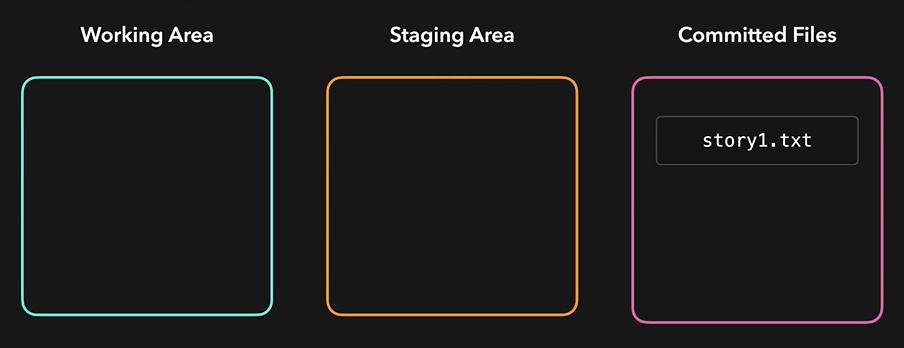

# Initialize a Git Repository
  - Take me to [Video Tutorial](https://kodekloud.com/courses/1085975/lectures/23241017)

In this section, we will take a look at initializing a git repository

#### Let's initialize a local git repository
- Go into a project folder and initialize git
  ```
  $ cd /Users/lydiahallie/Desktop/myproject
  $ git init
  ```
- We have initizalized an empty git repository in a **`.git`** folder
  
  
  
- To list all the contents of the folder including the hidden folder such as .git folder
  ```
  $ ls -a
  ```
#### Let's add a file to a project
- Create a file with a basic sentence
  ```
  $ touch story1.txt
  $ echo "This is a beautiful story" >> story1.txt
  ```
- To see the status of git
  ```
  $ git status
  ```
## git status
- Default branch will be master branch
- Untracked files are files that are not added to the git

 
 
## git add
- To add a file to the staging area
  ```
  $ git add story1.txt
  ```
  
## git commit

- To commit the changes
  ```
  $ git commit -m "Added first story"
  ```
  
 
 
