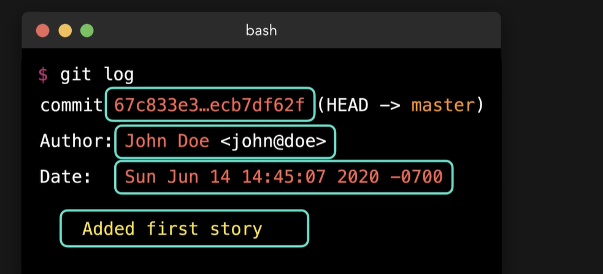
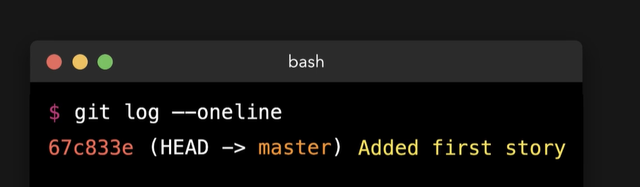

# Git Log
  - Take me to [Video Tutorial](https://kodekloud.com/courses/1085975/lectures/23241022)
  
To know about other commits information such as commit hash, the author name and the date
```
$ git log
```
 
  
To easily show commit details as one line
```
$ git log --oneline
```

 
  


