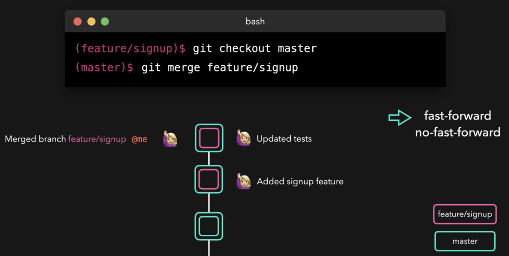
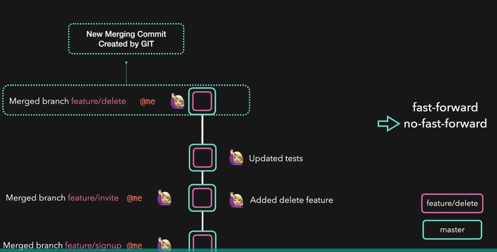

# Git Merging Branches
  - Take me to [Video Tutorial](https://kodekloud.com/courses/1085975/lectures/23241099)
  
In this section, we will take a look at git merging braches

#### We can merge a branch with 'git merge' command
```
$ git checkout master
$ git merge feature/signup
```

#### Two types of merge that git can perform
1. Fast forward merge
   
   
   
2. No-Fast Forward merge
   
   
   
 
  
