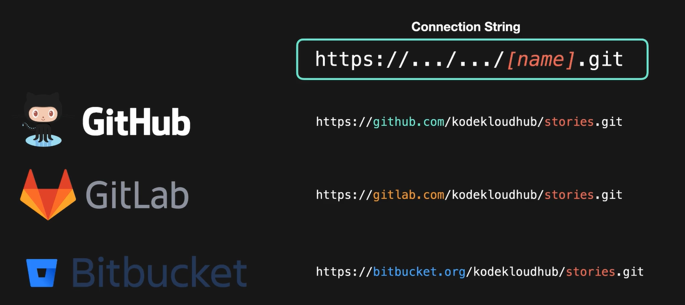
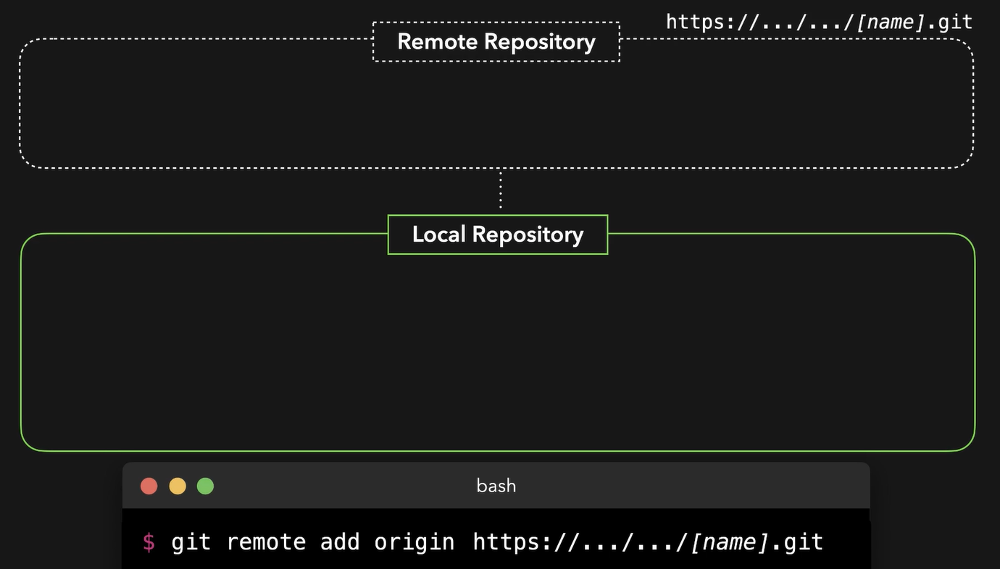
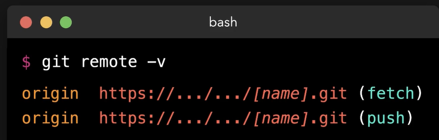

 # Initialize Remote Repositories
   - Take me to [Video Tutorial](https://kodekloud.com/topic/initialize-remote-repositories/)
   
 In this section, we will take a look at initializing remote repositories
 
 #### We can push code to the remote repositories that is hosted at somewhere else and get this code on our local machines by pulling this information.
 - There are several platforms where we can host our remote repositories. Most commonly used one are the below
   1. Github
   1. Gitlab
   1. Bitbucket
  
- Once we initialize a repository on those platform, we will get access to something called **`connection string`**.
  
- A connection string is the URL that we can use in order to let git know where the remote repository is located.
  
  
    
- To add a remote repository to a local project
  ```
  $ git add remote origin <connection URL>
  ```
    
  
    
- To list all remote repositories
  ```
  $ git remote -v
  ```
    
 
 

