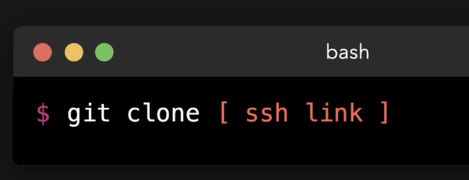
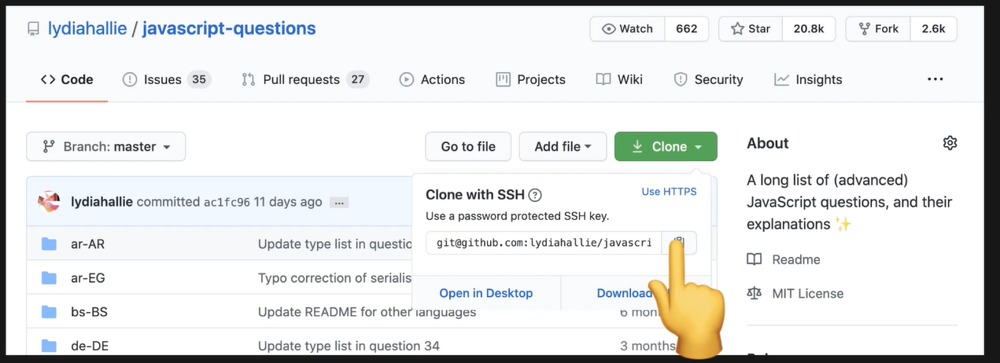
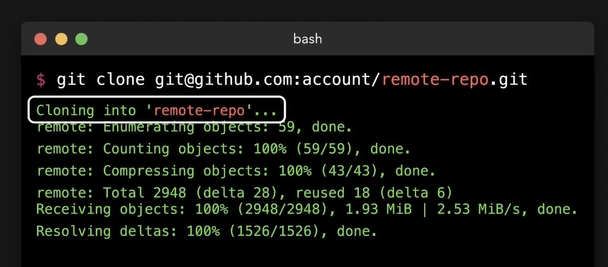
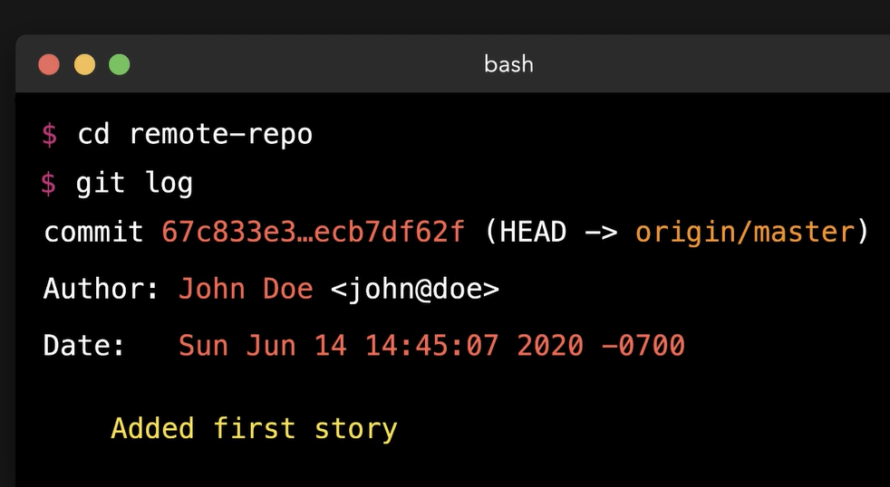

 # Cloning Remote Repositories
   - Take me to [Video Tutorial](https://kodekloud.com/courses/git-for-beginners/lectures/23241049)
 
 In this section, we will take a look at cloning remote repositories
 
 #### We can clone the remote repository on our local machines
 - To clone remote repo with ssh link
   ```
   $ git clone <ssh-link-goes-here>
   ```
   
   
   
   
 
   ```
   $ git clone git@github.com:account/remote-repo.git
   ```
   
   
   
 - To check the history of the project
   ```
   $ cd remote-repo
   $ git log
   ```
   
  
  
  
 
 
 
 
   
 
 
   
 
