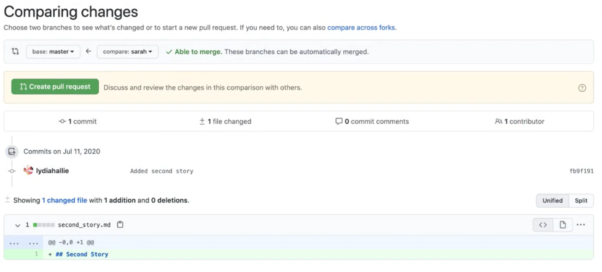
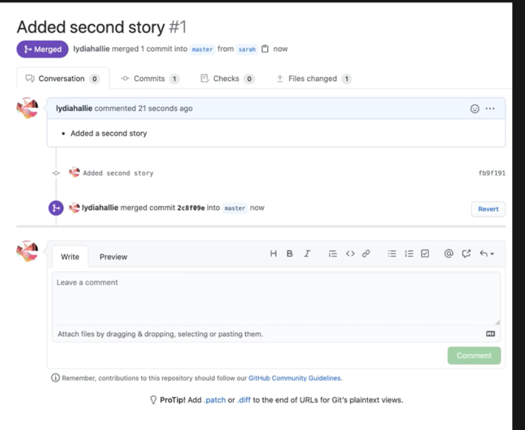

# Pull Requests
  - Take me to [Video Tutorial](https://kodekloud.com/courses/git-for-beginners/lectures/23429376)
   
In this section, we will take a look at Pull requests


To push the latest changes to github sarah branch
```
$ git push origin sarah
```

To push changes from sarah to master we have to open something called **`Pull Request`**

  

  

  
  


