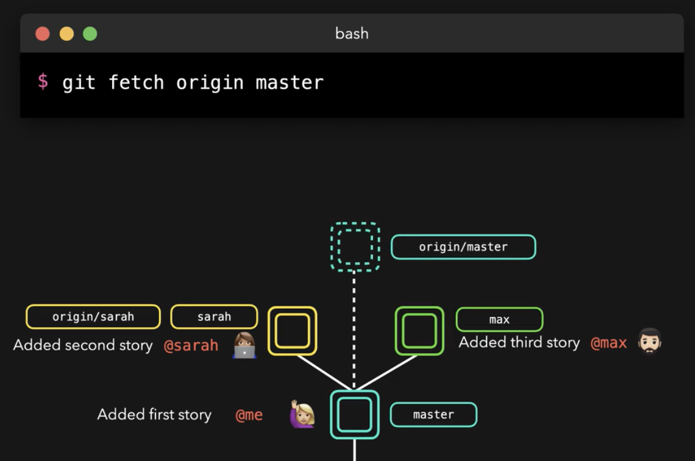

# Fetching and Pulling
  - Take me to [Video Tutorial](https://kodekloud.com/courses/git-for-beginners/lectures/23241126)
  
In this section, we will take a look at fetching and pulling

To update remote repository in our local repo
```
$ git fetch origin master
```



To update local master branch to point to the latest changes made on remote branch(origin/master). To merge origin/master into local master branch
```
$ git merge origin/master
```

To pull the remote branch
```
$ git pull origin/master
```


