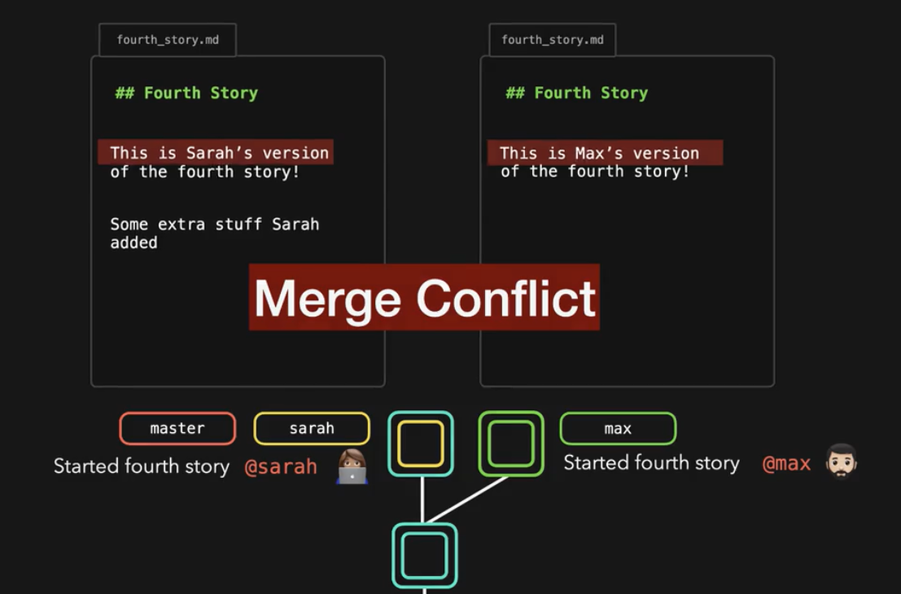
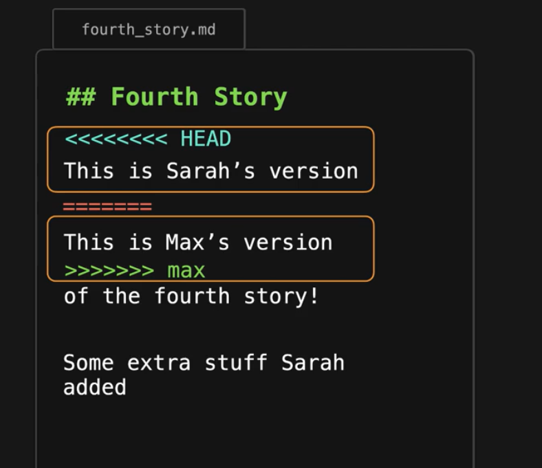
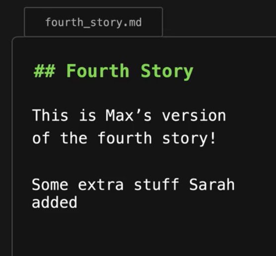
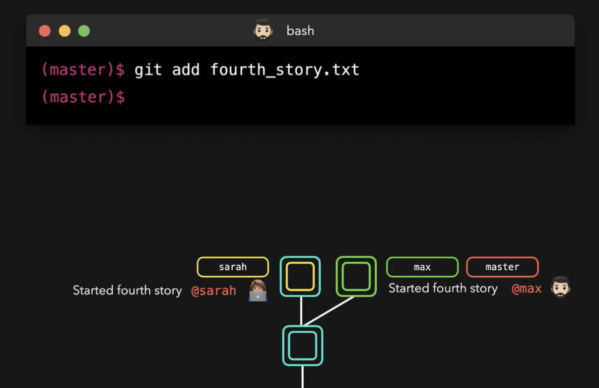

# Merge Conflicts
  - Take me to [Video Tutorial](https://kodekloud.com/courses/git-for-beginners/lectures/23429479)
  
In this section, we will take a look at merge conflicts



#### Remove the lines that we don't wanna keep to resolve the conficts and save the file.





` Add the changes to git again
  ```
  $ git add fourth_story.txt
  ```

  


