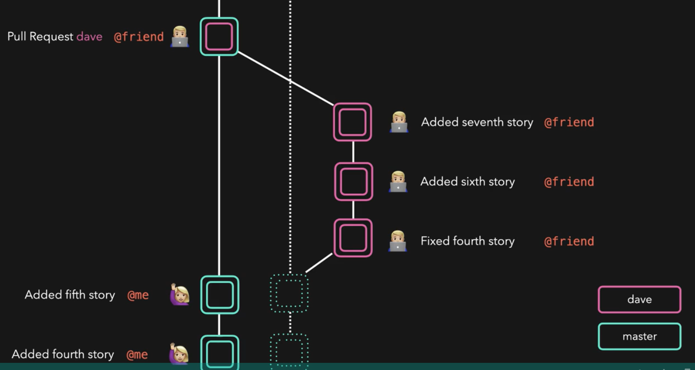

  # Fork
   - Take me to [Video Tutorial](https://kodekloud.com/courses/git-for-beginners/lectures/23529954)
    
 #### How do you create a pull request if you are not part of a git project?
 - One way to contribute such projects is to **`fork`** the main project.
 - After forking the project you can add your changes to a branch on the fork copy and send a pull request to the original project to merge your changes
   
   
   
