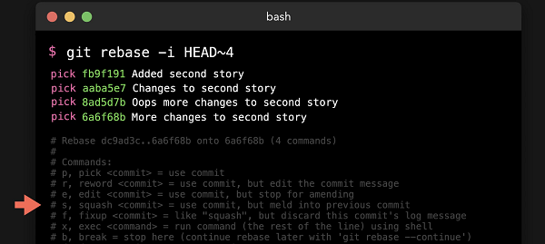
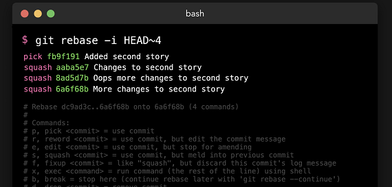

# Git Interactive Rebasing
  - Take me to [Video Tutorial](https://kodekloud.com/courses/1085975/lectures/23244813)


- In this section, we will take a look at git interactive-rebasing.
- When all commits are looking same and should be added into the single commit.
- We can change the history of the git branch within the interactive rebase. To access this we use `-i` flag with `git rebase` command.
- We have to specify which commits we want to update.
- Suppose we wants to modify first four commits. We are telling to git to rebase last 4 commits.

```
$ git rebase -i HEAD~4

```



- It will open the file into the editor, we need to change "pick" to "squash" command. After changing the commands save the file and exit.



- After this, it will combind the commits. There are so many other options when you are interactively rebasing. It's very powerful tool to changes to your branch and commits.
