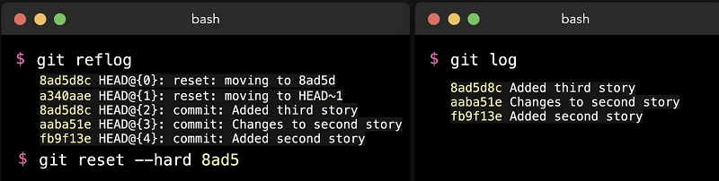

# Git Reflog
  - Take me to [Video Tutorial](https://kodekloud.com/topic/reflog/)

In this section, we will take a took at `git reflog` command.

- If commit is not neccessary at all and wants to remove then we can run the `git reset --hard` command: -

```
$ git reset --hard HEAD~1 
```

- After running this command, that data will be gone forever. But we don't need to be panic at all, `git reflog` command shows the all actions that have been taken to the repository. This includes resets, reverts and merges.

```
$ git reflog
``` 

- You can easily undo the mistakes you made in the repository that information `reflog` command gives us.

- You can get the hash value from the `git reflog` command as we already see in the previous process.

```
$ git reset --hard 8ad5
```

- After this repository has been set into the previous state.

- You can see that `git reflog` status also changed.

```
$ git reflog
```

- `git log` and `git reflog` may look smiliar. `git log` will show you only information about the commits not the status about repository that `git reflog` does.

```
$ git log
  
$ git reflog  
```

