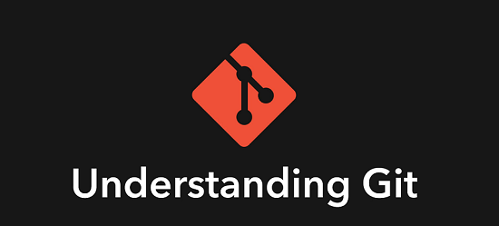

# Understanding GIT
  - Take me to [Video Tutorial](https://kodekloud.com/topic/understanding-git/)
  



- We have seen that how we can interact with the Git. Now let's take a look , how Git actually works. 
- Git is nothing more than a key-value store. When we add a file to the commit, the contents of the file are hashed using the shell one algorithm. The hashed is then used as a key name for the directory and stores the file using that key name.

- Git has `porcelain` command and `plumbing` command.

## Porcelain Commands
- Porcelain commands are commands like `git add`, `git commit`, `git status`. They are easy for user to remember.

### git add
- To add a file to the staging area.

```
$ git add first_story.txt
```

### git status
- To show the status of the untracked files. Untracked files are files that are not added to the git.

```
$ git status
```

### git commit
- To commit the changes.

```
$ git commit -m 'First Story'
```


### git stash
- We can stash all changes in the working area with `git stash` command. Modification in the working area, all get added to the stash.

```
$ git stash
```

## Plumbing Commands

- With the `plumbing` commands, we can access the internals of the git.

### git hash-object
- It's hashed the contents of the file. First two character of the hash is used as the key. This is the name of the directory	that's store the contents of the file.

```
$ git hash-object doc.txt

e965047ad7c57865823c7d992b1d046ea66edf7

$ ls ./.git/objects/
01  0b  e6  e9  info  pack
```

### git cat-file
- With this plumbing command, we can see the contents of the hashed. Used **-p** flag to print the contents. Use first couple of characters of the complete hash. 

```
$ git cat-file -p e96504
 
Git Story
```
### git ls-files
- With this command, we can list all the files of the specific branch.

```
$ git ls-files

lion-and-mouse.txt
foxes-and-oxes.txt
tiger-and-lion.txt
```

### Git Object Contents
- It can be three different object types.

a.) **commit** - It's a simple commit. 

b.) **tree** - tree is a directory in your file system. It's associated with that repository.

c.) **blob** - It's just a piece of data. It's not a directory nor a commit.